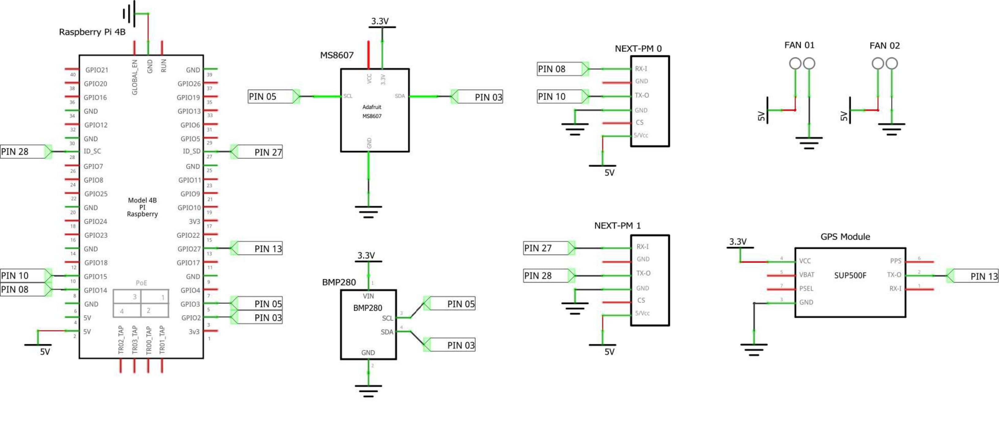
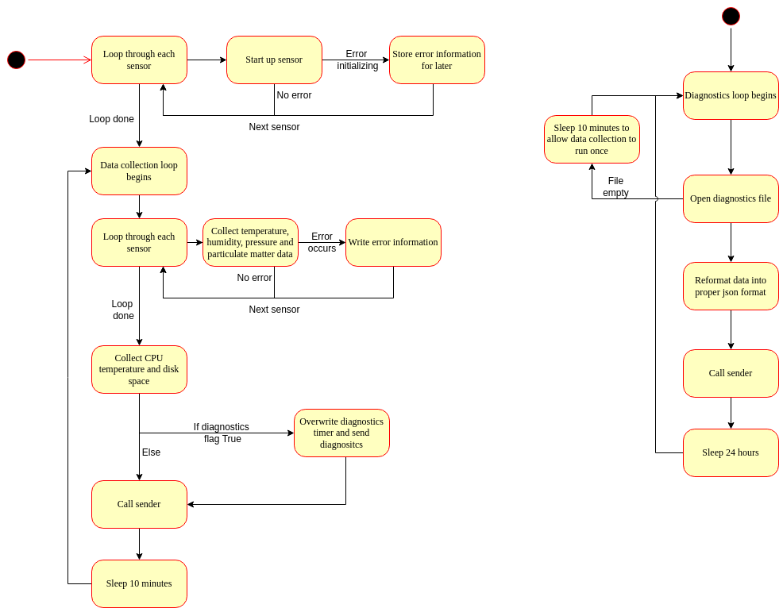

# Access Lab Measurement Stations

Version 2.0.1 
This version has been tested for all the new features and refactored code/modules. It is ready to deploy on the server

## Receiver

The receiver is a Flask server waiting for the various Access Stations to authenticate themselves and send data collected in the form of JSON files. It also checks data received for inconsistencies and damaged sensors. Additionally, it allows users to see the data collected by the station they're hosting. The receiver then acts as a middle-man, taking data from the stations and uploading them to a publicly available database.

### Dependencies

The receiver is running 
* Python 3.8.10
* pip3 20.0.2
* Ubuntu 20.04.4 LTS (Focal Fossa)

Python dependencies
* Flask 2.1.2
* werkzeug 2.1.2
* numpy 1.22.4
* pandas 1.5.3
* ssl
* pymongo 4.3.3

#### Installation

```console
$ sudo apt-get update
$ sudo apt-get upgrade
$ sudo apt-get install python3
$ sudo apt-get install python3-pip
$
$ pip3 install Flask
$ pip3 install numpy
$ pip3 install pandas
$ pip3 install pymongo
```

### Folder Structure

```console
./
 |-- cert.pem
 |-- key.pem
 |-- diagnostics.py
 |-- read_station_data.py
 |-- receiver.py
 |-- modules/
 |   |-- files.py
 |   |-- mongo.py
 |-- received_files/
 |   |-- station0/
 |   |   |--
 |   |-- station1/
 |   |   |--
 |   </>
 |   |-- station<n>/
 |   |   |--
 |-- diagnostics/
 |   |-- station0/
 |   |   |--
 |   |-- station1/
 |   |   |--
 |   </>
 |   |-- station<n>/
 |   |   |--
 |-- logs/
 |   |-- 2022_11.txt
 |   </>
 |   |-- <year>_<month>.txt
 |
```

### Related Files
* `cert.pem`: self-signed certificate for the HTTPS connection.
* `key.pem`: private key to go along with `cert.pem`.
* `diagnostics.py`: (CURRENTLY ONLY PARTIAL IMPLEMENTATION) goes over all data sent by stations and checks for discrepancies.
    * Sensor drift by comparing the difference between redundant sensor measurements (TO BE IMPLEMENTED).
    * Check diagnostics information whenever sensors provide such.
    * Check for missing sensor data (i.e a sensor no longer reporting anything)
    * Report errors found in data (TO BE IMPLEMENTED).
* `receiver.py`: flask server to receive data and diagnostic files, show users data collected, and upload information to the database.
* `modules/files.py`: methods centered around files and directories that receiver and mongo need.
* `modules/mongo.py`: Mongo class to handle all communiocation with the MongoDB database, including all data updates and info reading.  
* `received_files/`: directory where flask server will save both sha256 checksums and data collected. Files from station `i` will be stored in the subdirectory `received_files/stationi`
* `diagnostics/`: directory where server saves sha256 checksums and diagnostics collected. Files from station `i` will be stored in subdirectory `diagnostics/stationi`.
* `logs/`: directory to store per-month logging informatino. Scripts will automatically create new files for new months.


### Setting up

The code uses relative paths so it's essential these files and programs run from the same path where `receiver.py` is stored.

1. Set environment variables.
    ```console
    $ export FLASK_APP=receiver.py
    ```

2. Generate self-signed certificate using pyopenssl.

    ```console
    $ openssl req -x509 -newkey rsa:4096 -nodes -out cert.pem -keyout key.pem -days 3652 
    ```

    This leads to the following prompt to fill in:

    ```console
    Generating a RSA private key
    ....++++
    .........................................................................................................................................++++
    writing new private key to 'key.pem'
    -----
    You are about to be asked to enter information that will be incorporated
    into your certificate request.
    What you are about to enter is what is called a Distinguished Name or a DN.
    There are quite a few fields but you can leave some blank
    For some fields there will be a default value,
    If you enter '.', the field will be left blank.
    -----
    Country Name (2 letter code) [AU]:AE
    State or Province Name (full name) [Some-State]:Abu Dhabi
    Locality Name (eg, city) []:Abu Dhabi
    Organization Name (eg, company) [Internet Widgits Pty Ltd]:Access
    Organizational Unit Name (eg, section) []:Access
    Common Name (e.g. server FQDN or YOUR name) []:ip_addr
    Email Address []:
    ```

    `ip_addr` must be the server's ip address.

    In the [Sender](#setting-up-1) section, we will cover how to send the certificate to the Access Stations. This new certificate-key pair should last for about 10 years (3652 days). Typically a shorter expiry is recommended, but for testing and for this lab, 10 years will be chosen. The current certificates will expire on May 2032 and must be replaced in all stations.

### Running the receiver

Make sure to change your current directory to the same as `receiver.py`. 

```console
$ flask run --host=my_ip --port=3500 --cert=cert.pem --key=key.pem
```

`my_ip` should be the public IP address of the server.

Some operating systems have port 443 (HTTPS) reserved, thus to avoid any possible errors, this project will use arbitrarily chosen port `3500`.

This will run the app in development mode. This is not recommended as it is less stable. However, for the time being and for testing purposes, it will do.

#### Receiver Paths and Webpages

All sites unrelated to the station-server data sending are currently unimplemented.

* `/`:  Presents users with a search bar to view their station's data. Currently unimplemented.
* `/view/station<i>`: dynamic url to view each station. `<i>` is to be replaced by the station's number. Currently unimplemented.
* `/register/`: new stations will send their information here to:
    
        a) allow the station to test if it's connected to the internet.
        b) map the user's email to a given station, allowing the user to find and view their station's data.
        c) send the station's sensor config file to the main server.

* `/upload/`: stations contact this subdirectory to request an upload channel. The receiver will authenticate the station using the hexadecimal ids and return a random string.
* `/upload/<rand_str>`: temporary subdirectorys created to upload files. The server performs integrity tests (sha256 checksums) before accepting files sent here.

#### Response Codes

The receiver will respond with any of the following codes to the stations:

* `200`: request successful, files received and checksum verified.
* `301 new_url`: the request to send a file was received successfully and the file should be sent to `/upload/new_url`.
* `401`: unathorized request. The server will ignore the request.
* `412`: precondition failed, files/headers necessary not sent in request.
* `415`: unsopported file type received, request rejected.
* `500`: error receiving file, checksum could not be verified.

#### Possible errors

The following errors will be logged into the receiver's log files.

* `Error finding files and folders`: receiver could not find `ids.json` or the folder `received_files/`. The server will not run. Please make sure `uplodad.py`, `received_files/`, and `ids.txt` are all in the same directory and that the server 
* `Unauthorized access, rejected`: receiver failed to find a valid pi_id in the request. The request is ignored.

The rest of the errors assume successful validation of the station.

* `Required files not included`: The request to send a file does not include the file or the checksum. File does not get downloaded, request is ignored.
* `Empty file or checksum fields`: the file and checksum are not missing but are left empty by the sender. Request gets ignored.
* `Wrong file type`: the sent file is of the wrong type. Request is ignored.
* `Wrong checksum`: the checksum sent does not match the sent file. The file is not downloaded and the request is ignored.

___

## MongoDB

This section will cover all the different collections and data layouts for our mongo database.

### Database

All information stored by this project will be housed in a database called `stations`.

### Collections

The database will house two kinds of collections: those that store station data and one that stores administrative data.

Each station will have its own collection to store its data, `db["station<n>"]` for the n<sup>th</sup> station. In it, every station will have a config document, identified by the key-value pair `{"config": true}`. The other documents are all separated by month and include data collected by that station. Examples of both will be provided below.

The `db["stations_info"]` collection will contain copies of all the configuration documents of all stations in one centralized collection.

### Sample Documents

Below is a sample configuration document. Recalll the `id` is a unique hexadecimal string that identifies each station. Stations marked as stationary have a fixed location while non-stationary may be mounted on a moving vehicle.
```json
{
    "config": true,
    "sensors": {
        "particulate_matter": 2,
        "air_sensor": 2,
        "gps": 1
    },
    "id": "0000000000000000",
    "email": "youremail@sample.com",
    "stationary": true,
    "station_num": 3
}
```

Below is a sample data document based on the one found at the end of the documentation. There are differences in how mongo and the files will be stored. They are designed for people to request entire bulks of monthly data. All arrays act as parallel arrays, allowing for ease of plotting. All months follow the naming convention `MM_YYYY`. All fields stored in arrays act as a timeseries for that month, with new entries appended to the end. To differentiate between multiple sensors, each sensor in a station is mapped to its respective index (i.e "0" or "1" in this case since there are 2 of each sensor). 

```json
{
    "month": "2022_07",
    "particulate_matter": {
        "PM1count": {
            "0": [174],
            "1": [176]
        },
        "PM2,5count": {
            "0": [175],
            "1": [178]
        },
        "PM10count": {
            "0": [176],
            "1": [178]
        },
        "PM1mass": {
            "0": [12.8],
            "1": [12.6]
        },
        "PM2,5mass": {
            "0": [20.8],
            "1": [20.6]
        },
        "PM10mass": {
            "0": [40.4],
            "1": [43.7]
        },
        "sensor_T": {
            "0": [36.15],
            "1": [36.0]
        },
        "sensor_RH": {
            "0": [66.22],
            "1": [66.01]
        },
        "type": {
            "0": "nextpm",
            "1": "nextpm"
        }
    },
    "air_sensor": {
        "type": {
            "0": "bme280",
            "1": "ms8607"
        },
        "humidity": {
            "0": [63.82468880562936],
            "1": [64.14846801757812]
        },
        "temperature": {
            "0": [35.023828125],
            "1": [35.04]
        },
        "pressure": {
            "0": [994.0989164570198],
            "1": [993.72]
        }
    },
    "gps": {
        "datetime": [ISODate("2023-03-07T16:52:06Z")],
        "position": [[54.432657166666665, 24.524455833333334]],
        "lat_dir": ["N"],
        "lon_dir": ["E"],
        "altitude": [-30.9],
        "alt_unit": "M",
        "num_sats": [6],
        "PDOP": [2.99],
        "HDOP": [1.65],
        "VDOP": [2.5]
    }
}
```


## Access Stations

The Access Stations have two main modes: boot and data collection.

### Dependencies

The access stations are running 
    
* Python 3.9.2
* pip3 20.0.2
* Raspbian GNU/Linux 11 (Bullseye)

Python dependencies
* Flask 2.1.2
* requests 2.25.1
* pyserial 3.5
* pigpio 
* pynmea
* adafruit_bme280
* adafruit_ms8607
* threading

Other dependencies
* hostapd 2:2.9.0-21
* dnsmasq 2.85-1
* pigpiod 1.79-1+rpt1

### Folder Structure

```console
/home/pi/
 |-- boot/
 |   |-- app.py
 |   |-- dependencies.py
 |   |-- setup.py
 |   |-- state.txt
 |   |-- services/
 |   |   |-- flask_app.service
 |   |   |-- setup.service 
 |   |   |-- diagnostics.service
 |   |-- static/
 |   |   |-- app.js
 |   |   |-- styles.css
 |   |   |-- images/
 |   |   |   |-- ACCESS_LOGO_SQUARE_violet_drop1.png
 |   |-- templates/
 |   |   |-- index.html
 |   |   |-- no_networks.html
 |   |   |-- testing_wifi.html
 |-- ACCESS_station_lib.py
 |-- cert.pem
 |-- data_collection.py
 |-- diagnostics.py
 |-- sender.py
 |-- sensors.py 
 |-- station_id.py
 |-- station.config
 |-- test.py
 |-- logs/
 |   |--
 |-- data_logs/
 |   |--
 |-- packages/
 |   |-- modules.py
 |-- sent_files/
 |   |--
 |--
```

### Related Files

All files inside the boot folder will setup the Access Station.

* `boot/app.py`: small flask server whos only purpose is to collect the wifi information from the user in order to connect.
* `boot/dependencies.py`: Installs all necessary dependencies and moves necessary services to `/lib/systemd/system/`.
* `boot/setup.py`: main driver for setting up the access stations. Checks the current state of the machine and continues with next steps by running other files / executing commands.
* `boot/state.txt`: stores the current state of the station. If the file is non-existant, the state is assumed as 0. States can range from 0 to 5.
* `boot/services/*`: system services to automatically run the setup and the flask app each time the station boots.
* `boot/static/*`: resources for the flask app such as images, stylesheets, and javascript code.
* `boot/templates/*`: html pages for the flask app to render.
* `sent_files/`: folder to store successfully sent files. Files here are stored by month collected in subdirectories.
* `logs/`: stores logging info of data collected.
* `data_logs/`: stores data and diagnostics files temporarily until sender can upload them to server.
* `ACCESS_station_lib.py`: wrapper classes to connect and interact with the sensor's hardware.
* `cert.pem`: self-signed certificate used by the server for https.
* `data_collection.py`: collects information from the sensors every 10 minutes.
* `sender.py`: sends data collected to the receiver server.
* `sensors.py`: initializes sensors, to be configured/modified depending on which sensors are connected where.
* `station_id.py`: contains the Pi's unique 16-digit hexadecimal ID and the station number, must be set manually.
    
    ```python
        # sample contents of 'station_id.py'
        secret = '4820FA34CB9D873E'
        station_num = '3' # must be as string
    ```

* `station.config`: json object detailing how many of each sensor connected to the station (not including GPS). This file is automatically created after running `test.py`. A sample can be seen below:
    ```json
    {
        "particulate_matter": 2,
        "air_sensor": 2
    }
    ```
* `test.py`: tests to see if all the connections to the hardware are working well. Sets up the configuration file for the station.


### Setting Up

This guide will follow the steps from boot up to operation required to set up the Access Station.

1. Booting the RPi: configure the keyboard and and username. The user for all stations should be `pi`. 

1. Configure the settings:

    ```console
    $ sudo raspi-config
    ```
    1. Enable `Interface Options`->`SSH`
    1. Enable `Interface Options`->`I2C`
    1. In `Interface Options`->`Serial Port`, disable login shell but enable serial port hardware.
    1. Configure `Localisation Options`->`WLAN Country.

1. Connect to the network.
    ```console
    $ sudo nano /etc/wpa_supplicant/wpa_supplicant.conf
    ```
    and add the following at the end of the file:

    ```console
    network={
        ssid="nyu"
        proto=RSN
        key_mgmt=WPA-EAP
        eap=PEAP
        identity="net_id"
        password="password"
        phase2="auth=MSCHAPV2"
        priority=1
    }
    ```

    replacing `net_id` and `password` with your own.    

    Then reboot the RPi to connect and implement the settings from step (2).

1. Download the necessary files and setup the folder structure as described [here](#folder-structure). Be sure to give the RPi its unique ID, and update the server to accept this ID. The server setup is the last step in this list. Copy the files from the GitHub and modify the samples to reflect the RPi's unique ID.
    
    To download the certificate file from the server, scp the file.
    
    ```console
    $ scp user@server_ip:path_to_cert/cert.pem /home/pi/
    $ export REQUESTS_CA_BUNDLE=/home/pi/cert.pem
    ```

1. Make sure Python3 and pip3 are properly installed.

    ```console
    $ sudo apt update
    $ sudo apt upgrade -y
    $ sudo apt-get install python3-pip -y
    ```

1. Run `dependencies.py` to install all dependencies.

    ```console
    $ python3 /home/pi/boot/dependencies.py
    ```

1. Configue serial ports, making sure the `ttyS0` is not set as `serial0`.

    ```console
    $ sudo nano /boot/config.txt
    ```

    Add the following at the bottom of the file.

    ```console
    dtoverlay=miniuart-bt
    dtoverlay=uart2
    ```

    Make sure both serial ports are properly set by running

    ```console
    $ ls -l /dev
    ```
    
    `serial0` should be mapped to `ttyAMA0` and `ttyAMA1` should also appear on the outputs.

1. Connect the RPi to the sensors
    
    1. GPS can be connected to a GPIO pin. The `ACCESS_staion_lib` uses `GPIO 27` as default, and only connects to the GPS' output.
    1. The particle measurement sensors are connected to uart0 (`/dev/ttyAMA0`) and uart2 (`/dev/ttyAMA1`), corresponding to pins `GPIO 14` / `GPIO 15` and `GPIO 0` / `GPIO 1` respectively.
    1. The air sensors (temperature, humidity, and pressure) are connected to the I2C pins, `GPIO 2` and `GPIO 3`. Both are connected throught the bret board, as the Waveshare BME280 can be configured to use address `0x77` while the MS 8607 uses `0x76`.
    
    Modify `sensors.py` to properly initialize each sensor, depending on how they where plugged in.
    
    `sensors.py` will then loop through the sensors created and assign an index to each. This is necessary for data_collection later and is done automatically.

1. Run `test.py` to do a quick test of all the hardware. If the software doesn't crash, the test was succesful.

1. Start the setup mode.
    ```console
    $ sudo systemctl enable setup
    $ sudo systemctl start setup
    ```

1. Create a config document in the MongoDB database. This document should be stored in the `stations_info` collection. A sample can be seen below:
    ```json
    {
        "config": true,
        "id": "056F0BC2E9812C0A",
        "stationary": true,
        "station_num": 3
    }
    ```
    Stationary indicates whether this station will always collect data from the same location or will be moving.

### Hardware

Be sure to enable all pins being used. By default, RPis have only 1 UART port enabled (necessary for the particulate matter sensors). Be sure the miniUART port is also not assigned to the pins the sensor is using. [setup](#setting-up-1) covers how to change to mapping of the pins from `ttyS0` to the desired `ttyAMA0`.

As more sensors and fans are connected to the RPi, be sure to use the appropriate cables to supply the adequate voltage and current. Otherwise, the RPi can get stuck in boot.

The prototype station built has the following sensors and connections:

1. 2 NEXT PM sensors
1. 1 BME280 sensor
1. 1 MS8607 sensor
1. 1 GPS sensor
1. 2 5V fan



### Boot Mode

Boot mode runs every time the Pi starts up. It goes through 5 different possible states to configure the RPi and start up data collection.

1.  The RPi will configure itself to run as a wireless access point and automatically reboot to enact changes.
2. The RPi will act as a router and server, hosting the flask website `app.py` to collect wifi information. Users can connect to the `access` network and visit `http://192.168.4.1:3500`. Here, the user can input the necessary information for the RPi to connect to their wifi.
3. The RPi will revert back from a wireless access point, necessary to test the wifi information given.
4. The access station will attempt to connect to the wifi and contact the main server. If this fails, the RPi will return to state 1. If it works, the main server will register the user's email and move to state 5.
5. The access station is now connected to the internet and will collect/send data.

### Data Collection


### Possible errors

Data Collection:
* If at boot, `sensors.py` fails to contact a sensor, rather than initiating the appropriate beseecher class, it initiates that sensor as an `ErrorBeseecher` object, storing the error information. During each data collection cycle, it will raise this error.
* During data collection, when polling sensors, if the CPU temperature is too high (`> 70°`), the disk space is too full (`> 80%`), or an exception is raised (wheter from the ErrorBeseecher class or a runtime error with the sensor), the error is logged into the diagnostics file and sent to the server.

Sending data:
* `PI id not found`: the sender failed to import its own id. The script will stop running. Make sure the file `secret.py` is in the same directory as `sender.py` and has the following: `secret='pi_id'` where pi_id is a 16-digit hexadecimal string.
* `Missing arguments`: the sender did not get the required arguments. The script will stop running.
* `arg2 not a valid directory`: sender could not access the folder with the logs to send. The script will stop running.
* `https://arg1:3500 could not be reached`: sender could not reach flask receiver, the script stops running 
* `Authentication failed`: server was unable to verify Pi's identity, sender stops running
* `file_name could not be sent`: error verifying checksum of sent file. Sender will simply keep that file in the logs folder rather than moving it to the directory of sent files. The script will continue to run, sending other files. This unsent file will be sent the next time the script runs.

## The ACCESS Station library

This library includes a `Beseecher` class. All other beseecher classes (except GPS-related classes) inherit the attributes from this parent class. All child beseecher classes must overwrite the `.measure()` method, to provide the brand-specific commands to interrogate the sensor. This method must return a dictionary of `property: value` pairs, as well as two additional key-value pairs: 

```JSON
"type": <brand>,
"sensor": <data_being_measured> 
```

Type will differentiate sensors that collect the same data but from different brands, while sensor describes the data being measured. This allows `data_collection.py` to treat all sensors as the same, and through these 2 fields separate the data into appropriate fields. Of these 2 keys, `type` is purely for the user and serves no purpose in the code, and thus is not strictly necessary, though highly recommended. `sensor` though is necessary. Additionally, each beseecher class inherits variables containing the `type` and `sensor` information. This is in case an error occurs when interrogating sensors. Having these two class variables will allow the error handling to recover important diagnostic information. Lastly, all classes inherit `index` variable. This is assigned automatically by the code and makes sure that the multi-threaded sensor interrogation always places the same sensors in the same order.

The exception to the rule is GPS. The code assumes each station has exactly 1 GPS sensor and the code treats it different to other sensors. It lacks the `type` and `sensor` keys and its data is collected separately from the other sensors in the data_collection loop.

Make sure no `property: value` pair has any `.` in the property name. Mongo uses `.` for queries and this would interfere with the database.

### Sample Data

```json
{
    "particulate_matter": [
        {
            "PM1count": 174,
            "PM2,5count": 175,
            "PM10count": 176,
            "PM1mass": 12.8,
            "PM2,5mass": 20.8,
            "PM10mass": 40.4,
            "sensor_T": 36.15,
            "sensor_RH": 66.22,
            "diagnostics": {
                "Degraded": false,
                "Notready": false,
                "Eccess_RH": false,
                "T_RH_off": false,
                "Fan_error": false,
                "Mem_error": false,
                "Las_error": false
            },
            "sensor": "particulate_matter0",
            "type": "nextpm"
        },
        {
            "PM1count": 176,
            "PM2,5count": 178,
            "PM10count": 178,
            "PM1mass": 12.6,
            "PM2,5mass": 20.6,
            "PM10mass": 43.7,
            "sensor_T": 36.0,
            "sensor_RH": 66.01,
            "diagnostics": {
                "Degraded": false,
                "Notready": false,
                "Eccess_RH": false,
                "T_RH_off": false,
                "Fan_error": false,
                "Mem_error": false,
                "Las_error": false
            },
            "sensor": "particulate_matter1",
            "type": "nextpm"
        }
    ],
    "air_sensor": [
        {
            "type": "bme280",
            "humidity": 63.82468880562936,
            "temperature": 35.023828125,
            "pressure": 994.0989164570198,
            "sensor": "air_sensor0"
        },
        {
            "type": "ms8607",
            "humidity": 64.14846801757812,
            "temperature": 35.04,
            "pressure": 993.72,
            "sensor": "air_sensor1"
        }
    ],
    "date_time_position": {
        "date": "2022-07-21",
        "time": "16:50:12",
        "latitude": 24.524989,
        "lat_dir": "N",
        "longitude": 54.43276483333333,
        "lon_dir": "E",
        "altitude": -30.9,
        "alt_unit": "M",
        "num_sats": 6,
        "PDOP": 2.99,
        "HDOP": 1.65,
        "VDOP": 2.5
    }
}
```

In the sample data, the `sensor` attribute is concatenated with the `index` attribute to generate the final string added as unique identifier for that sensor. It is also **IMPORTANT** to note that NO key can contain `.`, as Mongo uses `.` for queries. Instead, entries like `PM2.5count` have been updated to `PM2,5count`. 
